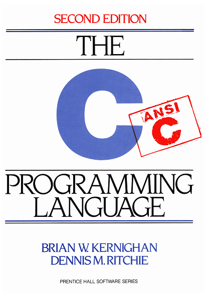

## The C Programming Language

This is a repository for codes and exercises within the following book

- B. W. Kernighan, and D. M. Ritchie, *The C Programming Language*, 2nd Edition, Prentice Hall, 1988.

As the publishing year of the book suggests, it follows the C89 standards. However, we may use some new
features of the C99 or C11 within the codes. You can take a look at [this wikipedia page][1] for a brief
history of the C standards. All of the codes were tested with the `gcc` compiler.

    

[1]: https://en.wikipedia.org/wiki/C_(programming_language)#History